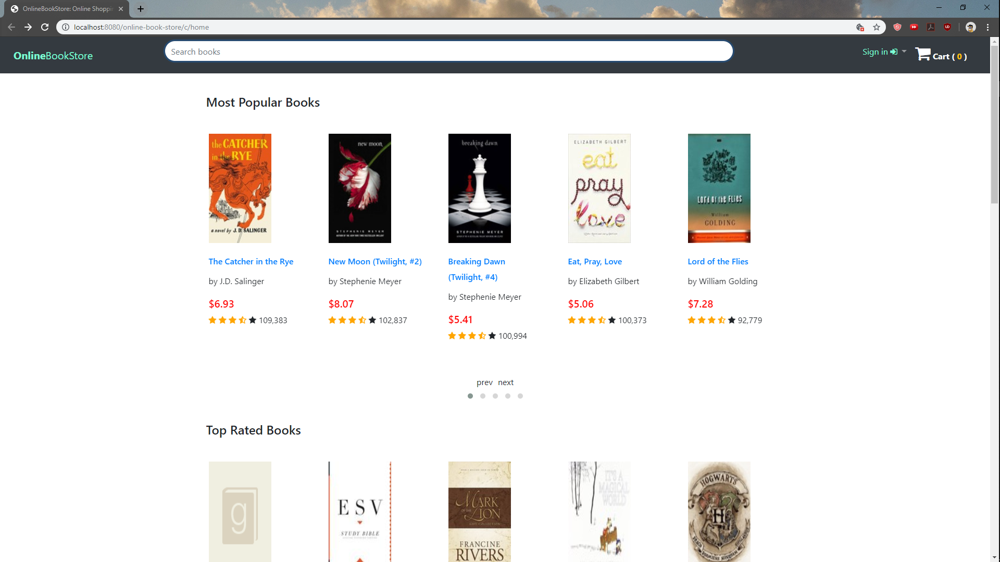
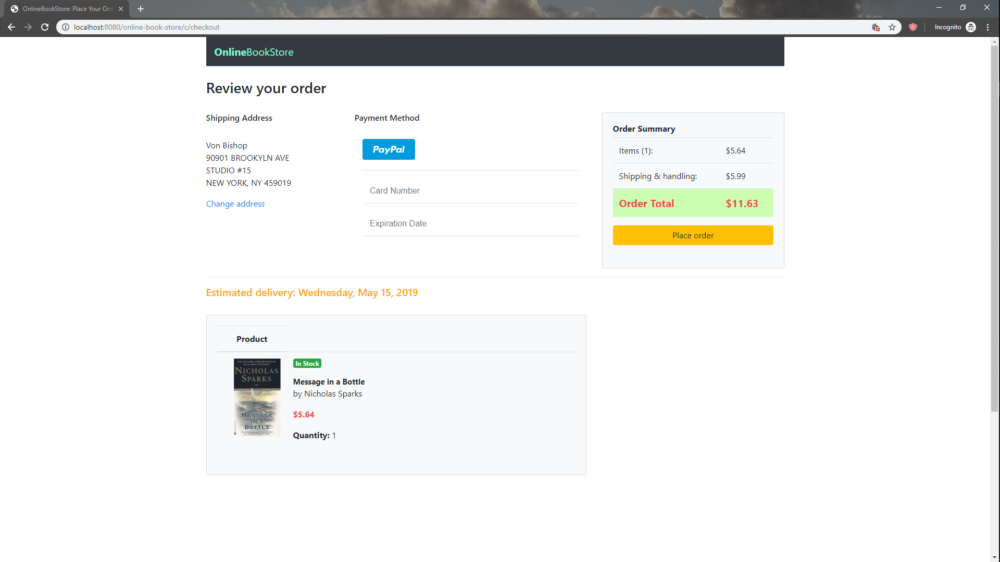
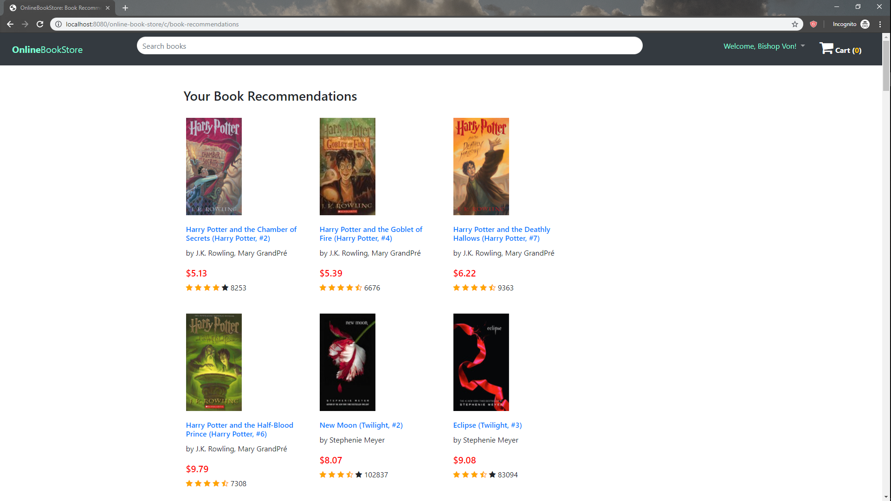

# online-book-store
A fully functional web application that interfaces with MySQL using JDBC along with Java, 
Tomcat, and JSP. Application is deployed on Amazon Web Services (<a href="https://www.uipath.com/rpa/robotic-process-automation" target="_blank" rel="noopener noreferrer">AWS</a>). Also, [UiPath RPA](https://www.uipath.com/rpa/robotic-process-automation)
was used to simulate user registration and login.
<br>
<br>

<br><br>

<br><br>

<br>

## Getting Started
These instructions will get you a copy of the project up and running on your local machine for development and testing purposes. See deployment for notes on how to deploy the project on a live system.
### Prerequisites/Requirements
* Mac OS X 64 bit
* Windows 64 bit
* Linux 64 bi
<p>Download Eclipse Java EE.
Apache Tomcat 7.0 or higher. </p>

```
https://www.eclipse.org/downloads/packages/
https://tomcat.apache.org/
```
### Installing
Clone the current repository
```
git clone https://github.com/ajmengistu/online-book-store.git
```
Open the project in Eclipse & run the program using Apache TomCat 7.0 or higer
Vist the default localhost server on a web browser
```
localhost:8080/online-book-store/
```


## Deployment
### Amazon Web Services
Deployed Java Applications on AWS Elastic Beanstalk
```
https://docs.aws.amazon.com/elasticbeanstalk/latest/dg/create_deploy_Java.html
```
### Heroku
Deploying Java Apps on Heroku

```
https://devcenter.heroku.com/articles/deploying-java
```
## Authors
* Aderajew Mengistu

## License
This project is licensed under MIT License

## Ackowledgments
* (Kaggle)[https://www.kaggle.com/datasets] for providing the list of books
* (Stack Overflow)[https://www.stackoverflow.com]

## Resources
### Kaggle Dataset
* https://www.kaggle.com/zygmunt/goodbooks-10k
* Data Source Used: `books.csv`
* The dataset `books.csv` contains a list of 10,000 books with various attributes including number of ratings, average ratings, publication year, and image urls. 
